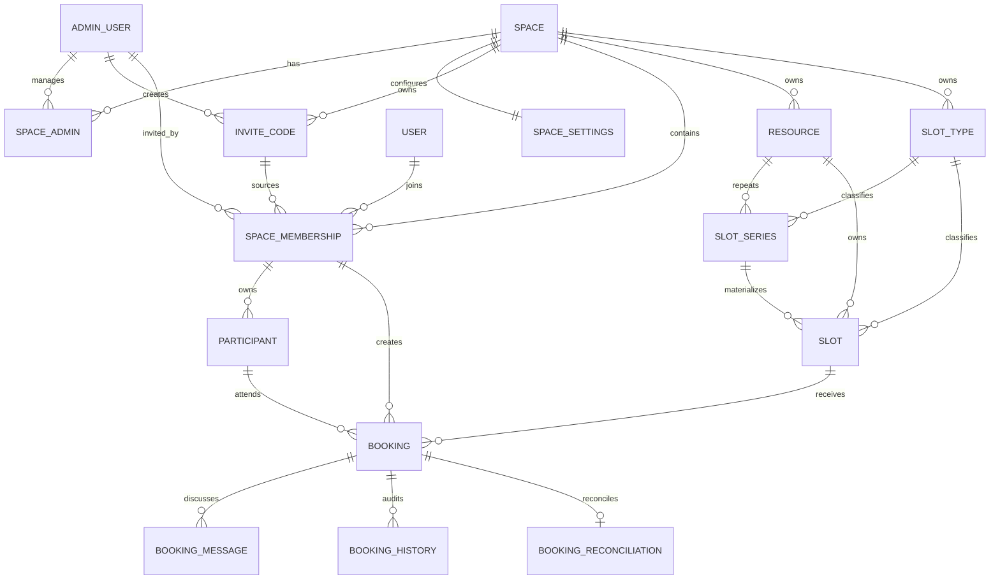

# Yu言在线 MVP 领域模型 / MVP Domain Model

> 本文是 V0.3 需求冻结后的技术设计基线。领域语义以本文、D1 migration 和 `packages/shared` Contract 为单一事实源。

## 1. 领域边界

MVP 按四个领域组织：

- **identity**：微信用户、Cloudflare Access 管理员身份。
- **tenant**：Space、Space Membership、Space Admin、Invite Code、Space Settings。
- **resource**：Resource、Slot Type、Slot Series、Slot。
- **reservation**：Participant、Booking、Booking Message、Booking History、对账查询。

Space 是所有业务数据的租户边界。MVP 使用一个 D1 数据库，通过 `space_id`、复合外键和服务层授权实现逻辑隔离；暂不采用“一 Space 一 D1”。

## 2. 核心 ER



## 3. 时间模型

### 3.1 Space 时区

每个 Space 必须有 IANA timezone，例如 `Asia/Shanghai`。

- 周期规则用 **Space 本地日期/时间** 表达。
- 具体 Slot 同时保存 `start_at` / `end_at`（UTC epoch milliseconds）和 `local_date`。
- API 对外时间统一使用 ISO 8601；数据库内部关键比较使用 epoch milliseconds。

这样可以避免周期规则在夏令时或未来跨时区扩展时产生歧义。

### 3.2 Slot 是完整预约单位

管理员选择的开始与结束时间直接形成一个 Slot。

例如：

```text
09:00–12:00 => 一个 3 小时 Slot
```

MVP `capacity = 1`，不拆分成 30/60 分钟的小 Slot。

### 3.3 同一 Resource 禁止时间重叠

两个仍占用时间的 Slot（`open` / `frozen`）若满足：

```text
existing.start < new.end
AND existing.end > new.start
```

则视为重叠并拒绝。

该约束由 D1 Trigger 最终兜底，而不是只靠前端或业务层预检查。

`cancelled` Slot 不再占用时间；`frozen` Slot 仍占用时间。

## 4. Slot Series / 周期开放

### 4.1 Canonical Rule + Concrete Slot

`slot_series` 保存周期规则，`slots` 保存可实际预约的具体实例。

最终 Booking **永远引用具体 Slot**，不直接引用 Series。

MVP 不要求后台 Cron 才能正常工作。查询一个日期范围前，resource domain 调用幂等的 `ensureSeriesMaterialized(from, to)`，为该范围补齐尚未生成的具体 Slot。唯一索引 `(series_id, series_occurrence_date)` 保证重复物化安全。

### 4.2 仅本次

修改具体周期 Slot：

- 保留原 `series_id` 与 `series_occurrence_date`；
- 标记 `is_series_exception = 1`；
- 只修改该 Slot；
- 后续物化发现该 occurrence 已存在时不覆盖。

### 4.3 本次及之后

从某个 occurrence 开始切分：

1. 旧 Series 的 `ends_on` 收口到该 occurrence 前一天；
2. 创建新的 Series，并通过 `supersedes_series_id` 指向旧 Series；
3. 未来尚未预约的旧 Slot 取消并按新规则重新物化；
4. 已有 Booking 的 Slot 不得静默移动或删除，必须作为冲突返回给管理员显式处理。

### 4.4 整个周期

更新 Series 后重新计算未来 Slot。

- 已发生历史不回写；
- 已有 Booking 的未来 Slot 作为冲突显式返回；
- 未预约且尚未开始的未来 Slot 可取消并按新规则重新物化；
- Series 内部保存 `materialize_after_at` 修订边界，确保后续查询旧日期时不会按新规则补造历史 Slot；
- `materialize_after_at` 是内部一致性字段，不属于小程序 / Web 的产品 Contract。

## 5. Booking 一致性

### 5.1 Capacity = 1

数据库通过 partial unique index 维护：

```sql
UNIQUE(slot_id) WHERE status IN ('booked', 'completed')
```

因此两个并发请求即使同时认为 Slot 可用，也只有一个可以成功写入。

取消 Booking 后，它不再占用 Slot，因此可重新预约。

### 5.2 Slot 是核心时间资源：四层状态模型

Slot 本身只保存生命周期状态：

- `open`：Slot 处于开放生命周期；
- `frozen`：Slot 仍占用 Resource 时间，但不接受新预约；
- `cancelled`：Slot 已撤销，不再占用 Resource 时间；这是终态，不重新启用。

`open` 不等于“当前一定可预约”。一个 Slot 在运营上同时有四个彼此独立的维度：

1. **Lifecycle / 生命周期**：`open | frozen | cancelled`；
2. **Occupancy / 占用**：由关联 Booking 决定，当前有效占用为 `booked | completed`；
3. **Temporal / 时间位置**：例如预约截止前、已过 booking cutoff、进行中、已过去；该状态按当前时间动态推导，不落成 Slot 枚举；
4. **Availability / 可预约性**：`bookable` 是综合 Space、Resource、Slot lifecycle、occupancy、cutoff 后的派生结果。

因此“已预约”“已完成”“已对账”都**不是 SlotStatus**，而是 Booking / Reconciliation 的事实，再投影到 Slot 运营视图。这样避免把多个正交维度组合成 `booked_frozen`、`completed_settled` 等不可维护的状态枚举。

### 5.3 Slot 取消与历史不可变规则

Slot 不使用物理删除承载业务状态；Web Admin 的“取消时段”实际把 Slot 置为 `cancelled`。

核心不变量：

- 空闲的 `open | frozen` Slot 可以取消；
- Slot 上存在 `booked` Booking 时，**必须先取消 Booking，再取消 Slot**；
- Slot 上存在 `completed` Booking 时，该 Slot 已成为历史服务事实的一部分，**不能取消/删除**；
- 数据库 Trigger `trg_slots_prevent_cancel_with_active_booking` 对 `booked | completed` 做最终保护；
- Booking `cancelled` 后不再占用 capacity，因此 Slot 若仍为 `open` 可再次被预约，或由管理员取消。

Booking 状态保持：

- `booked`：已预约、服务尚未完成；
- `cancelled`：预约已取消，不再占用 Slot；
- `completed`：服务已经发生，持续占用该 Slot 的历史事实。

### 5.4 Completion / Fulfillment 与 Reconciliation

Yu言在线的核心业务主链定义为：

```text
Slot → Booking → Completion / Fulfillment → Reconciliation
```

当前 MVP 不单独创建 Fulfillment 实体，由 `Booking.status = completed` 承担服务完成事实，同时记录完成来源：

- `manual`：运营人员手动完成；
- `classin_import`：未来由 ClassIn 上课记录导入；
- `external_import`：其他外部文件导入；
- `external_api`：外部系统 API 驱动。

同时保留 `completion_external_reference` 与 `completion_batch_id`，用于未来追溯外部记录和导入批次。

完成与对账是两个独立维度。Booking 完成后创建一条一对一的 `booking_reconciliations`：

```text
Booking booked
  ├─→ cancelled
  └─→ completed
          │
          └─ Reconciliation pending → settled
```

规则：

- 对账对象是 **Booking，不是 Slot**；
- Booking 从 `booked` 变为 `completed` 时自动进入 `pending` 对账；
- 只有 `completed` Booking 可以标记 `settled`；
- 对账记录保存来源、时间、操作管理员、可选 batchId / note；
- 当前支持手动对账；模型预留 `import | external_api` 来源；
- Slot 日历通过 Booking Projection 显示“已完成 · 待对账 / 已完成 · 已对账”，但这些状态不复制保存到 Slot；
- migration 0004 会把升级前已经 `completed` 的 Booking 回填为 `pending`，避免历史完成记录没有对账状态。

### 5.5 截止规则

Space Settings 保存两个独立配置：

- `booking_cutoff_minutes`
- `cancellation_cutoff_minutes`

取值：

```text
15 / 30 / 60 / 240 / 1440 / null
```

`null` 表示“不限”。

截止时间属于业务规则，服务层在写入前计算；数据库仍负责最终唯一性和结构完整性。

## 6. 生命周期

不使用物理删除承载业务状态：

- Space：`active | disabled`
- Participant：`active | inactive`
- Resource：`active | inactive`
- Slot Type：`active | inactive`
- Invite Code：`active | revoked`
- Slot Series：`active | ended | cancelled`

历史 Booking、Message、History 均保留。

## 7. 邀请来源

邀请码属于某个 Space，由某个管理员创建。

`space_memberships` 固化：

- `invite_code_id`
- `invited_by_admin_id`

即使邀请码过期/撤销或管理员之后被移出 Space，历史邀请来源仍保留。

邀请码是高熵随机值，真实值只存在运行时数据库与 API，不得出现在公开仓库、Fixture 或日志中。

## 8. 身份

### 小程序

- `wx.login` 获取临时代码。
- Worker 服务端换取微信身份并映射到 `users`。
- API 返回项目自己的短期签名访问令牌。
- 微信 AppSecret 等只通过 Cloudflare Secret 注入。

### Web Admin

- Cloudflare Access 负责认证。
- API 验证 Access JWT。
- `admin_users.access_subject` 作为稳定身份键，email 作为展示与辅助匹配字段。
- Super Admin 是平台角色；Space Admin 通过 `space_admins` 分配。

## 9. D1 强约束

首版 migration 使用：

- 外键：租户与实体关系完整性。
- CHECK：状态枚举、出生年月、截止时间枚举。
- Partial Unique Index：capacity=1。
- Trigger：同 Resource Slot 时间重叠。
- Trigger：有有效 Booking 的 Slot 不能被直接 cancelled。
- Trigger：新 Booking 必须指向 `open` Slot。

服务层仍必须做权限、截止时间、Space 状态、Resource/Participant 状态等业务校验，并把数据库错误映射成稳定 API Error Code。

## 10. 对账

对账以 **Booking 为结算事实单元**，Slot / Slot Type 只是时间与分类维度。MVP 不保存单价/金额；Booking 完成后进入 `pending`，运营人员可标记为 `settled`。后续统计与导出都基于 Booking + Reconciliation 聚合。

可按以下维度组合：

- Resource
- Participant
- Slot Type
- Booking Status
- Reconciliation Status
- Date Range
- Space 全局

金额由线下根据 Slot Type 计算。未来 ClassIn / 其他外部文件可以用于批量确认 Completion；对账导入可通过 batchId/source 追溯，但不把“完成”与“已对账”合并成一个状态。
